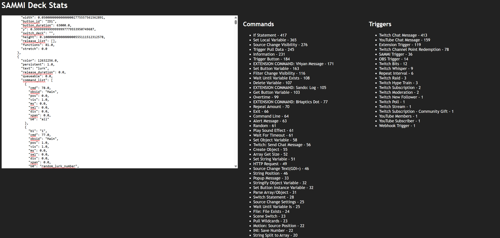

# Sammi Deck Stats
Paste in a decks_data.json or a deck that copied and get an idea of what commands you're using. Helpful for leaning about what plugins you rely on or possible migration needs.

Try it out at http://swolekat.github.io/sammi-deck-stats

